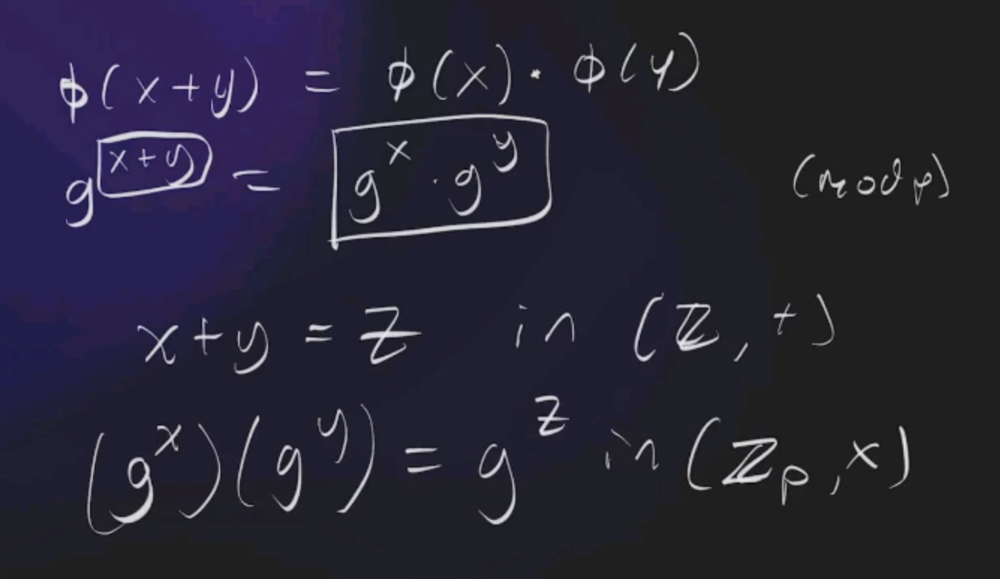

# Qn 4

Prove to me that you know the solution to in a zero knowledge fashion:
    2x + 8y = 7944
    5x + 3y = 4764

## Answer

Convert the equations to the form: g^x (mod p) 

 x + y = z 

converted:
 (g^x)(g^y) = g^z   (mod p)

The conversion is a homomorphism:
    The equation x + y = z, exists within the group G: (Z, +); integers under addition.
    The second equation exists within the group H: (g^i modp, *), g^i (mod p) under multiplication where i is some integer.

We know that the homomorphism exists because:
    f(a + b) = f(a) * f(b), where f(a) = g^a
    
    f(a + b) = g^a * g^b
    g^(a + b) = g^a * g^b
    g^(a + b) = g^(a+b)   

Therefore homomorphism exists.
Homomorphism from G: (Z, +) to H: (Zp, *)

So for someone to prove that they know the values of x and y, they can use the relationship x+y=z, and the homomorphism to create a proof
    proof: g^z

The verifier can confirm this to be true

## other comments
Should submit g^x and g^y; the verifier will simply calculate g^z to confirm that you do know correct values that fulfil the relationship x+y = z

If you submit just g^z, its possible to get the right z from the wrong combination of x and y:
    0 1 2 3 4 5 6 7 (mod 8)
For x + y = z:
    3 + 4 = 7  || 2 + 5 = 7   (mod 8) 

# DLP
* g and X (g^x) are publicly known
* with X, calculating x is computationally infeasible
* cos you are trying to solve: x = log_g X, which is a trapdoor function
* this brings us to DLP
* solving log_g X is one thing, solving it under mod p makes it even harder

you have no efficient algo for this, its pure brute-force. so under a large enough prime modulus, you'd be dead first.